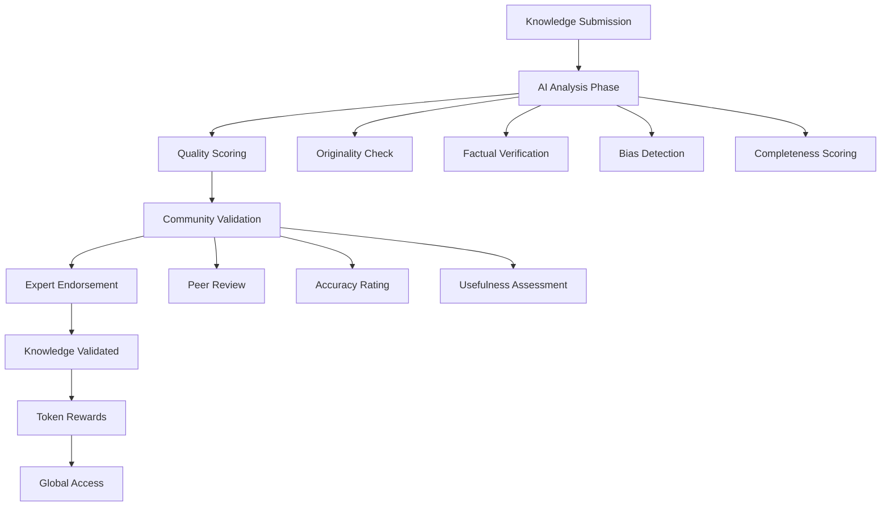
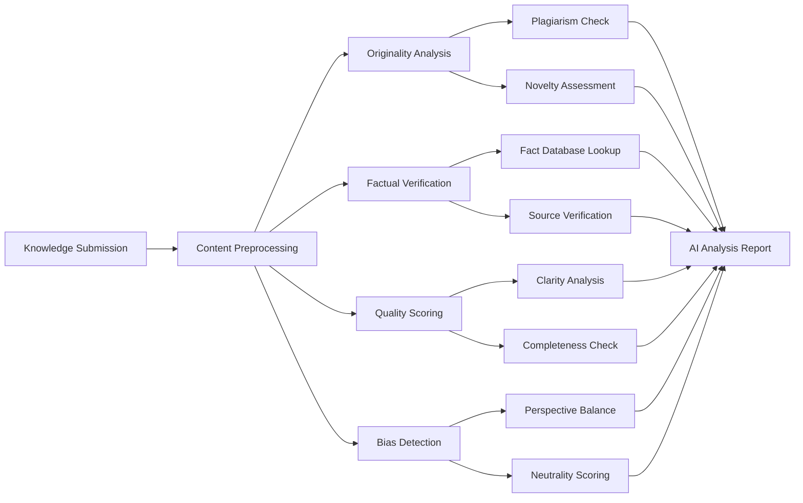

# 🧠 Global AI-Assisted Knowledge (GAIAK) Platform

A revolutionary decentralized knowledge ecosystem that combines artificial intelligence with community governance to create, validate, and distribute high-quality knowledge globally, built on the Stacks blockchain using Clarity smart contracts.

## 🌟 Vision

GAIAK transforms the knowledge economy by creating a **symbiotic ecosystem** where AI enhances human intelligence and community wisdom validates truth. We're building the world's first decentralized knowledge infrastructure where contributors are rewarded fairly and knowledge seekers access verified, high-quality information.

## 🏗️ Platform Architecture

### Core Innovation Pillars

1. **🤖 AI-Powered Curation**: Advanced AI analysis for quality assessment
2. **👥 Community Validation**: Democratic verification by domain experts  
3. **💰 Tokenized Incentives**: Knowledge tokens reward valuable contributions
4. **📊 Reputation Systems**: Merit-based credentialing and expert recognition
5. **🔍 Quality Assurance**: Multi-layer validation and bias detection
6. **🌍 Global Accessibility**: Borderless knowledge sharing and collaboration
7. **🛡️ Decentralized Governance**: Community-driven platform evolution

### Knowledge Lifecycle



## 🔧 Smart Contract Features

### 🎭 Multi-Stakeholder Ecosystem

#### **Knowledge Contributors**
- Submit original research, insights, and expertise
- Receive AI quality analysis and community feedback
- Earn knowledge tokens based on contribution value
- Build reputation through validated submissions
- Collaborate with AI systems for content enhancement

#### **Community Validators** 
- Review and rate knowledge submissions
- Stake tokens to participate in validation
- Earn rewards for accurate assessments
- Build reputation through quality evaluations
- Participate in platform governance decisions

#### **Knowledge Consumers**
- Access high-quality, validated information
- Pay tokens for premium knowledge access
- Rate and provide feedback on content
- Build personalized knowledge repositories
- Support contributors through token payments

#### **Domain Experts**
- Provide authoritative endorsements
- Mentor emerging contributors
- Lead specialized knowledge communities
- Influence platform quality standards
- Shape domain-specific validation criteria

### 🤖 AI Integration Framework

#### **Quality Analysis Engine**
- **Originality Assessment**: Plagiarism detection and novelty scoring
- **Factual Accuracy**: Cross-reference verification and fact-checking
- **Completeness Analysis**: Comprehensive coverage evaluation
- **Clarity Scoring**: Readability and comprehension metrics  
- **Relevance Rating**: Topic alignment and applicability
- **Bias Detection**: Neutrality analysis and perspective balance

#### **Confidence Metrics**
- AI confidence levels for all assessments
- Uncertainty quantification and transparency
- Human-AI collaboration recommendations
- Quality prediction and risk assessment

### 💰 Tokenomics & Economic Model

#### **Knowledge Token (KT) Utility**
- **Access Payments**: Premium knowledge consumption
- **Validation Staking**: Community review participation
- **Reward Distribution**: Contributor and validator incentives
- **Governance Voting**: Platform decision participation
- **Quality Multipliers**: Enhanced rewards for excellence

#### **Revenue Streams**
```
Platform Fee Structure (3% default):
├── Knowledge Access Fees
├── AI Analysis Service Fees  
├── Premium Validation Services
└── Expert Endorsement Fees

Token Distribution:
├── 70% → Content Contributors
├── 20% → Community Validators
├── 7% → Platform Development
└── 3% → AI Infrastructure
```

## 🚀 Getting Started

### Prerequisites

- [Clarinet 3.x](https://github.com/hirosystems/clarinet)
- [Stacks CLI](https://docs.stacks.co/docs/command-line-interface)
- Node.js and npm (for testing and development)

### Installation

1. **Clone the repository**
   ```bash
   git clone <your-repo-url>
   cd Global-AI-Assisted-Knowledge
   ```

2. **Verify contract**
   ```bash
   clarinet check
   ```

3. **Start development environment**
   ```bash
   clarinet integrate
   ```

4. **Run tests**
   ```bash
   npm install
   npm test
   ```

### Quick Start Guide

#### For Knowledge Contributors

1. **Create Your Profile**
   ```clarity
   (contract-call? .Global-AI-Assisted-Knowledge create-contributor-profile 
     "Dr. Sarah Chen" 
     "AI Research, Machine Learning, Quantum Computing")
   ```

2. **Submit Knowledge Entry**
   ```clarity
   (contract-call? .Global-AI-Assisted-Knowledge submit-knowledge
     "Breakthrough Quantum Machine Learning Algorithm"
     "Novel quantum-classical hybrid approach for exponentially faster pattern recognition in high-dimensional datasets, with applications in drug discovery and climate modeling"
     0x1234567890abcdef...  ;; Content hash (IPFS/Arweave)
     u6)  ;; Category: AI_ML
   ```

3. **Monitor AI Analysis**
   ```clarity
   ;; Check AI analysis results
   (contract-call? .Global-AI-Assisted-Knowledge get-ai-analysis u1)
   
   ;; View knowledge status
   (contract-call? .Global-AI-Assisted-Knowledge get-knowledge u1)
   ```

#### For Community Validators

1. **Validate Knowledge Submissions**
   ```clarity
   (contract-call? .Global-AI-Assisted-Knowledge validate-knowledge
     u1      ;; knowledge-id
     u5      ;; quality-rating (1-5 scale)
     u4      ;; accuracy-rating (1-5 scale) 
     u5      ;; usefulness-rating (1-5 scale)
     "Excellent methodology and comprehensive analysis. Minor presentation improvements suggested."
     u100)   ;; stake-amount in tokens
   ```

2. **Participate in Finalization**
   ```clarity
   (contract-call? .Global-AI-Assisted-Knowledge finalize-knowledge-validation u1)
   ```

#### For AI Systems (Oracle Integration)

1. **Submit Analysis Results**
   ```clarity
   (contract-call? .Global-AI-Assisted-Knowledge submit-ai-analysis
     u1    ;; knowledge-id
     u95   ;; originality-score (0-100)
     u88   ;; factual-accuracy (0-100)
     u92   ;; completeness-score (0-100)
     u87   ;; clarity-score (0-100)
     u94   ;; relevance-score (0-100)
     u15   ;; bias-detection (0-100, lower is better)
     u85)  ;; confidence-level (0-100)
   ```

#### For Knowledge Consumers

1. **Access Validated Knowledge**
   ```clarity
   (contract-call? .Global-AI-Assisted-Knowledge access-knowledge
     u1      ;; knowledge-id
     u50)    ;; token-payment
   ```

2. **Expert Endorsements**
   ```clarity
   ;; High-reputation users can endorse knowledge
   (contract-call? .Global-AI-Assisted-Knowledge endorse-knowledge
     u1    ;; knowledge-id
     u9    ;; endorsement-weight (1-10)
     u8)   ;; expertise-relevance (1-10)
   ```

## 📚 Comprehensive API Documentation

### Knowledge Management

#### `create-contributor-profile(name, expertise-areas)`
Creates comprehensive contributor profile with reputation tracking.
- **Parameters**: Personal identity and expertise domains
- **Returns**: Success confirmation  
- **Grants**: 1,000 initial knowledge tokens
- **Access**: Public

#### `submit-knowledge(title, summary, content-hash, category)`
Submits knowledge entry for AI analysis and community validation.
- **Parameters**: Knowledge details and categorization
- **Returns**: New knowledge ID
- **Requirements**: Minimum reputation threshold, AI analysis fee
- **Categories**: Science, Technology, Medicine, Education, Research, AI/ML

#### `get-knowledge(knowledge-id)`
Retrieves complete knowledge entry information.
- **Returns**: Comprehensive knowledge data structure
- **Access**: Read-only

### AI Integration

#### `submit-ai-analysis(knowledge-id, scores...)`
AI system submits comprehensive analysis results.
- **Parameters**: Multi-dimensional quality assessments
- **Scores**: Originality, accuracy, completeness, clarity, relevance, bias
- **Access**: AI Oracle (MVP: Public)
- **Triggers**: Community validation phase

#### `get-ai-analysis(knowledge-id)`
Retrieves detailed AI analysis results.
- **Returns**: Complete scoring breakdown and confidence metrics
- **Access**: Read-only

### Community Validation

#### `validate-knowledge(knowledge-id, ratings, feedback, stake)`
Community members validate knowledge submissions.
- **Parameters**: Quality assessments and feedback
- **Ratings**: Quality, accuracy, usefulness (1-5 scale)
- **Requirements**: Token staking, non-contributor validation
- **Access**: Community validators only

#### `finalize-knowledge-validation(knowledge-id)`
Completes validation process and distributes rewards.
- **Requirements**: Minimum 3 validators, validation period expired
- **Threshold**: 60% approval rate for validation
- **Rewards**: Quality-multiplied token distribution

### Token Economy

#### `access-knowledge(knowledge-id, token-payment)`
Pays tokens to access validated knowledge content.
- **Returns**: Content hash for verified knowledge
- **Distribution**: 97% to contributor, 3% platform fee
- **Requirements**: Sufficient token balance, validated knowledge

#### `get-knowledge-tokens(holder)`
Retrieves user's knowledge token balance.
- **Returns**: Current token balance
- **Access**: Read-only

### Expert Systems

#### `endorse-knowledge(knowledge-id, weight, relevance)`
High-reputation experts provide authoritative endorsements.
- **Requirements**: Minimum 50 reputation score
- **Parameters**: Endorsement strength and expertise relevance
- **Purpose**: Additional quality assurance and credibility

### Platform Information

#### `get-platform-stats()`
Retrieves comprehensive platform metrics.
- **Returns**: Total knowledge, validations, tokens, and fees
- **Access**: Read-only

#### Knowledge Categories
- **Science** (u1): Research papers, discoveries, theories
- **Technology** (u2): Technical innovations, engineering solutions  
- **Medicine** (u3): Medical research, treatments, clinical studies
- **Education** (u4): Learning materials, pedagogical methods
- **Research** (u5): Academic studies, experimental results
- **AI/ML** (u6): Artificial intelligence and machine learning advances

#### Quality Levels (AI-Determined)
- **Excellent** (5): Groundbreaking, highly original contributions
- **Good** (4): Solid, well-researched knowledge with clear value
- **Average** (3): Useful information with standard quality
- **Poor** (2): Basic content with limited value or issues
- **Unverified** (1): Preliminary content awaiting validation

### Admin Functions (Contract Owner Only)

#### `update-platform-fee(new-fee)`
Adjusts platform service fee (maximum: 10%).

#### `update-reputation-threshold(new-threshold)`
Modifies minimum reputation for knowledge submission.

#### `mint-knowledge-tokens(recipient, amount)`
Issues new knowledge tokens for ecosystem rewards.

## 🎯 Use Cases & Applications

### 1. **Academic Research Collaboration**
**Scenario**: Global research community sharing breakthrough discoveries
- **Contributors**: PhD researchers, professors, research institutions
- **Content**: Peer-reviewed papers, experimental data, theoretical frameworks
- **AI Analysis**: Novelty detection, methodology validation, reproducibility scoring
- **Community**: Domain experts, peer reviewers, academic institutions

### 2. **Corporate Knowledge Management**
**Scenario**: Enterprise knowledge sharing across global teams
- **Contributors**: Senior engineers, subject matter experts, consultants
- **Content**: Best practices, technical solutions, lessons learned
- **AI Analysis**: Practical applicability, implementation feasibility
- **Community**: Cross-functional teams, technical leads, domain specialists

### 3. **Medical Knowledge Network**
**Scenario**: Healthcare professionals sharing clinical insights
- **Contributors**: Physicians, researchers, medical institutions
- **Content**: Treatment protocols, case studies, diagnostic insights
- **AI Analysis**: Evidence quality, safety assessment, clinical relevance
- **Community**: Medical experts, healthcare institutions, regulatory bodies

### 4. **Open Source Innovation Hub**
**Scenario**: Developer community sharing technical knowledge
- **Contributors**: Open source maintainers, software architects, developers
- **Content**: Code patterns, architectural solutions, implementation guides
- **AI Analysis**: Code quality, security assessment, maintainability
- **Community**: Developer ecosystem, technical reviewers, project maintainers

### 5. **Educational Content Ecosystem**
**Scenario**: Educators creating and sharing learning materials
- **Contributors**: Teachers, curriculum designers, educational researchers
- **Content**: Lesson plans, learning methodologies, assessment strategies
- **AI Analysis**: Pedagogical effectiveness, learning outcome potential
- **Community**: Education professionals, subject experts, curriculum committees

## 🛡️ Security & Trust Framework

### Multi-Layer Validation
- **AI Pre-screening**: Automated quality and risk assessment
- **Community Consensus**: Democratic validation by stakeholders
- **Expert Endorsement**: Authority-based quality assurance
- **Reputation Weighting**: Historical performance consideration
- **Economic Staking**: Financial commitment to accuracy

### Anti-Gaming Mechanisms
- **Reputation Requirements**: Minimum thresholds for participation
- **Token Staking**: Economic penalties for poor validation
- **Multi-dimensional Scoring**: Comprehensive quality assessment
- **Time-locked Validation**: Prevents rushed decision-making
- **Cross-validation**: Multiple independent assessments

### Data Integrity
- **Content Hashing**: Cryptographic verification of submissions
- **Immutable Records**: Blockchain-based audit trails
- **Version Control**: Transparent knowledge evolution tracking
- **Attribution Systems**: Clear contributor recognition and rights

## 🔬 AI Integration & Technical Architecture

### AI Analysis Pipeline



### Oracle Integration
- **Decentralized AI Services**: Multiple AI provider integration
- **Consensus Mechanisms**: Cross-validation of AI assessments
- **Quality Assurance**: Human oversight and AI model validation
- **Continuous Learning**: Feedback loops for model improvement

### Privacy & Ethics
- **Data Minimization**: Only necessary information stored on-chain
- **Contributor Privacy**: Pseudonymous participation options
- **Ethical AI**: Bias detection and mitigation systems
- **Transparent Algorithms**: Open AI assessment criteria

## 📊 Platform Metrics & Success Indicators

### Growth Metrics
- **Knowledge Submissions**: Monthly contribution growth rate
- **Validation Participation**: Community engagement levels
- **Quality Scores**: Average AI and community ratings
- **Expert Endorsements**: Authority-backed content percentage
- **Token Velocity**: Economic activity and circulation

### Quality Metrics
- **Accuracy Rates**: Percentage of validated high-quality content
- **Community Consensus**: Agreement levels in validation
- **Expert Satisfaction**: Domain authority feedback scores
- **User Retention**: Contributor and validator return rates
- **Knowledge Utilization**: Access and citation frequencies

### Impact Metrics
- **Research Acceleration**: Time-to-discovery improvements
- **Collaboration Networks**: Cross-institutional partnerships
- **Knowledge Democratization**: Global access equity measures
- **Innovation Catalysis**: Breakthrough discovery attribution

## 🌐 Tokenomics Deep Dive

### Knowledge Token (KT) Economics

#### **Supply Mechanics**
- **Initial Supply**: 1,000,000 KT tokens
- **Inflation Rate**: 5% annually (adjustable by governance)
- **Distribution Schedule**: Merit-based algorithmic distribution
- **Burn Mechanisms**: Quality penalties and platform fees

#### **Value Accrual**
- **Utility Demand**: Knowledge access and platform services
- **Staking Rewards**: Validation participation incentives
- **Quality Multipliers**: Premium rewards for excellence
- **Governance Rights**: Platform decision-making power

#### **Reward Distribution Algorithm**
```clarity
base-reward = submission-quality-score * 100
ai-multiplier = (ai-quality-score >= 80) ? 3 : (ai-quality-score >= 60) ? 2 : 1
community-multiplier = (approval-rate >= 80) ? 2 : (approval-rate >= 60) ? 1.5 : 1
final-reward = base-reward * ai-multiplier * community-multiplier
```

### Economic Incentive Alignment
- **Contributors**: Rewarded for high-quality, valuable knowledge
- **Validators**: Compensated for accurate, helpful assessments  
- **Consumers**: Pay fair prices for verified, useful information
- **Experts**: Recognized and rewarded for authoritative endorsements

## 🚧 Development Roadmap

### Phase 1: Foundation (Current)
- ✅ Core smart contract implementation
- ✅ Basic AI integration framework
- ✅ Community validation system
- ✅ Token economy fundamentals

### Phase 2: AI Enhancement
- 🔄 Advanced AI oracle integration
- 🔄 Multi-modal content analysis
- 🔄 Personalized recommendation engines
- 🔄 Automated fact-checking systems

### Phase 3: Ecosystem Expansion
- 📅 Cross-chain knowledge sharing
- 📅 Enterprise integration APIs
- 📅 Mobile and web applications
- 📅 Academic institution partnerships

### Phase 4: Global Scale
- 📅 Multi-language support
- 📅 Regulatory compliance frameworks
- 📅 Institutional governance integration
- 📅 Knowledge marketplace evolution

## 🤝 Community & Governance

### Decentralized Governance Model
The GAIAK platform operates through **community-driven governance** where stakeholders collectively make decisions about:

- **Quality Standards**: Validation criteria and threshold adjustments
- **Economic Parameters**: Token distribution and fee structures  
- **AI Integration**: Oracle selection and analysis methodology
- **Platform Evolution**: Feature development and strategic direction

### Governance Mechanisms
- **Token-weighted Voting**: Stakeholder influence proportional to commitment
- **Expert Advisory Panels**: Domain authority in specialized decisions
- **Community Proposals**: Bottom-up initiative and improvement suggestions
- **Transparent Processes**: Open discussion and decision documentation

### Stakeholder Representation
- **Contributors Council**: Active knowledge creators and researchers
- **Validator Assembly**: Community members ensuring quality standards
- **Consumer Advocacy**: Knowledge seekers and platform users
- **Expert Advisory**: Domain authorities and institutional partners

## 🌍 Global Impact Vision

GAIAK aims to become the **world's primary knowledge infrastructure**, democratizing access to high-quality information and accelerating human progress through AI-enhanced collaboration.

### **Societal Benefits**
- **Educational Equity**: Global access to expert knowledge
- **Research Acceleration**: Faster discovery and innovation cycles
- **Quality Assurance**: Reliable, validated information sources
- **Economic Opportunity**: Fair compensation for knowledge creation

### **Scientific Advancement**
- **Cross-disciplinary Collaboration**: Breaking down knowledge silos
- **Reproducibility**: Enhanced verification and validation systems
- **Open Science**: Transparent, accessible research sharing
- **Innovation Catalysis**: AI-human collaboration for breakthroughs

### **Economic Transformation**
- **Knowledge Economy**: Direct monetization of intellectual contributions
- **Global Participation**: Borderless knowledge work opportunities
- **Quality Premium**: Rewards for excellence and expertise
- **Sustainable Models**: Long-term value creation and distribution

## 📜 License

This project is licensed under the MIT License - see the [LICENSE](LICENSE) file for details.

## 🤝 Contributing

We welcome contributions from the global knowledge community!

### Development Guidelines
1. **Fork the repository**
2. **Create feature branch** (`git checkout -b feature/knowledge-enhancement`)
3. **Commit changes** (`git commit -m 'Add revolutionary knowledge feature'`)
4. **Push to branch** (`git push origin feature/knowledge-enhancement`)
5. **Open Pull Request**

### Code Standards
- Follow Clarity best practices and security guidelines
- Include comprehensive test coverage for all functions
- Update documentation for new features and capabilities
- Maintain backward compatibility and migration paths
- Prioritize security, privacy, and ethical considerations

## 📞 Support & Resources

- **GitHub Issues**: Bug reports and feature requests
- **Community Discord**: Real-time collaboration and support
- **Documentation Portal**: Comprehensive guides and tutorials
- **Research Papers**: Technical specifications and methodology
- **Developer Blog**: Platform updates and technical insights

## 🙏 Acknowledgments

- **Stacks Foundation**: Blockchain infrastructure and development ecosystem
- **Clarinet Team**: Smart contract development and testing framework
- **AI Research Community**: Advanced analytics and quality assessment systems
- **Knowledge Contributors**: Global network of researchers, experts, and innovators
- **Open Source Contributors**: Platform development and enhancement efforts

---

## 🔮 The Future of Knowledge is Collaborative

**GAIAK represents a fundamental shift** from centralized knowledge gatekeepers to a truly democratic, AI-enhanced ecosystem where human intelligence and artificial intelligence work together to create, validate, and distribute the highest quality knowledge for the benefit of all humanity.

**Join us in building the knowledge infrastructure of the future** - where expertise meets opportunity, where quality is rewarded, and where the collective intelligence of humanity is amplified by AI to solve the world's greatest challenges.

---

**🧠 Ready to revolutionize knowledge sharing? Start building with GAIAK today!**

*Built with ❤️ for the global knowledge community*

# Global AI-Assisted Knowledge

